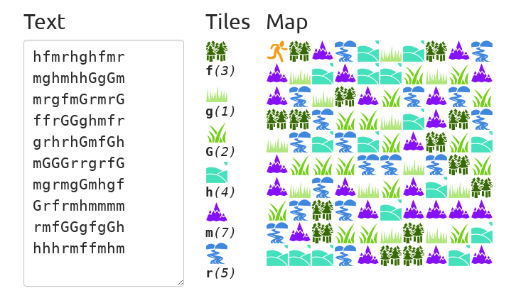

# Shortest-Path-Game

Below is an example of how the boards are set up.

Benchmarked on an early 2015 MacBook Pro.
Results are averages of well over 50 trials.

| N             | Elapsed Time  | Memory Usage   |
|---------------|---------------|----------------|
| 10            | 0:00.00 s     | 1192 kb        |
| 20            | 0:00.00 s     | 1192 kb        |
| 50            | 0:00.00 s     | 1192 kb        |
| 100           | 0:00.00 s     | 1192 kb        |
| 200           | 0:00.00 s     | 1192 kb        |
| 500           | 0:00.07 s     | 1192 kb        |
| 1000          | 0:00.41 s     | 1192 kb        |
|---------------|---------------|----------------|

To benchmark, use the command below and replace N with a value:
UNIX> for n in {1..20}; do /usr/bin/time -f "real %E CPU %P mem %M kb" ./generate_map N | src/dijkstras> /dev/null; done
